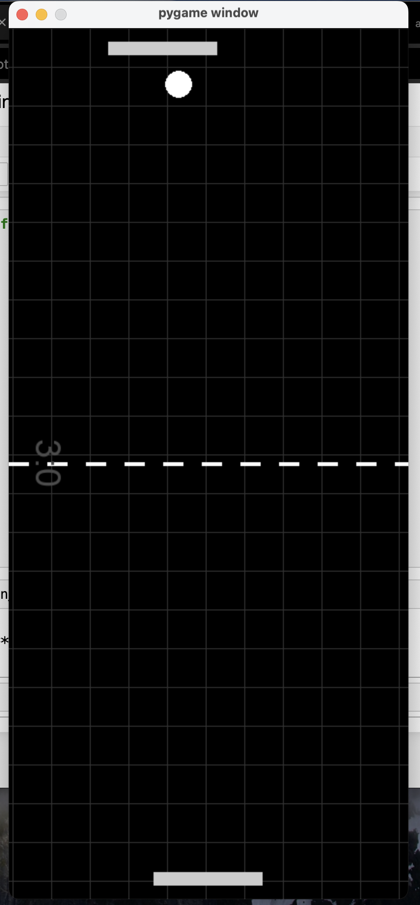

# 🏓 Unbeatable Pong

A simple  implementation of the classic **Pong** game using **Pygame**.

In this version, the game agent is programmed to be extremely hard (if not impossible) to beat.

## 🎮 Features

- Agent predicts ball trajectory and auto-moves to intercept it
- Built with Python and Pygame
- One-player mode (vs unbeatable AI)

## 🧠 How It Works

The AI calculates the expected x-position of the ball when it reaches the paddle's y-position. It then moves horizontally toward that target.

## 📷 Screenshot

  

## ▶️ Getting Started

### Requirements

- Python 3.x
- Pygame

Install Pygame:
```bash
pip install pygame
```
Run the game:
```bash
python3 pong.py
```
## 📝 License
MIT License. Feel free to use, modify, and share!
